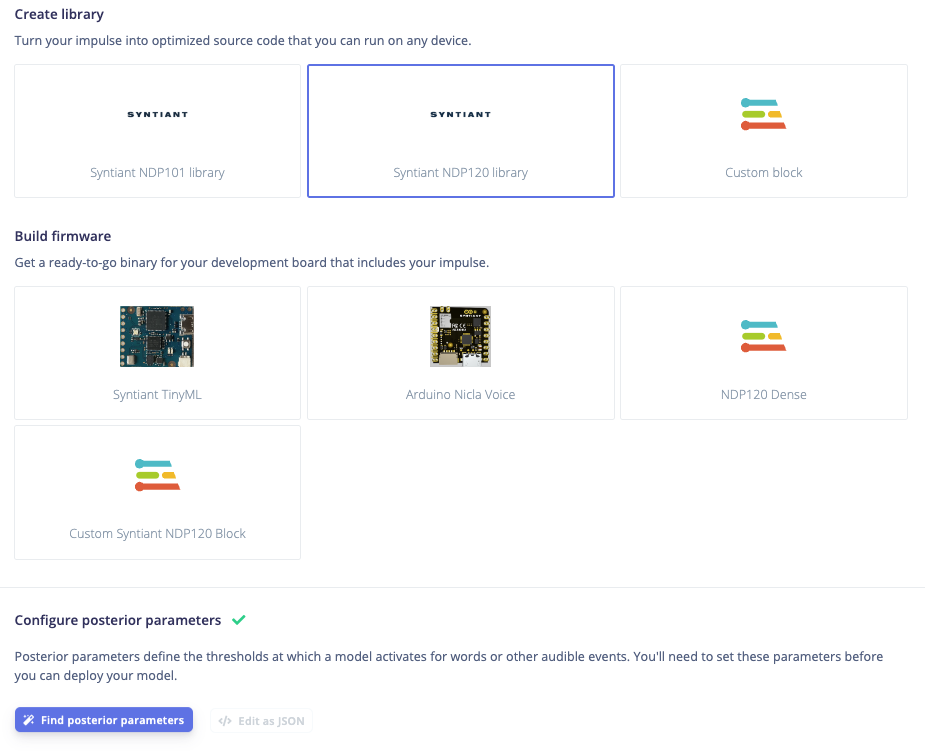
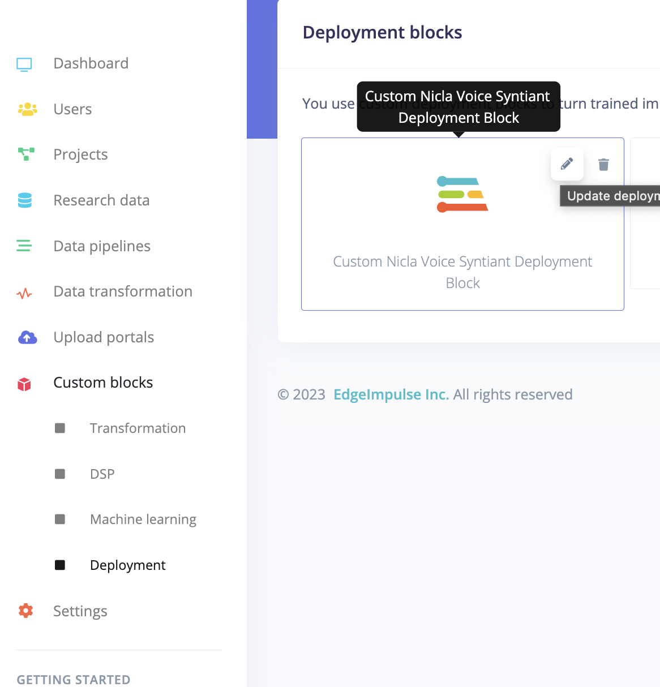

# Syntiant TDK for NDP120/200 support

This repo contains the dockerized version of Syntiant TDK for NDP120/200 for Deployment. Edit the `generate_synpkg_lib.sh` script to add in any further functionality. Currently the syntiant model packages are zipped up and provided as a download when the library is built.

To avoid the need to provide your own copy of the Syntiant TDK, this container uses the [Edge Impulse API](https://docs.edgeimpulse.com/reference/downloadbuild) to call the built-in syntiant package build process, then pass that through to the arduino nicla voice firmware build. 


### Set up your Posterior Parameters

Syntiant models require posterior parameters to build correctly. This is passed directly into the deployment via an API call, but you need to generate the parameters from the deployment page for another Syntiant build block before running this one. This is because custom blocks don't have access to the UI to create parameters at the moment:



### To push to your Edge Impulse org:

From the syntiant-custom-deployment-block folder run the following:

```
edge-impulse-blocks init
```
This will generate a .ei-block-config file tied to a block in your org. To upload the block run:
```
edge-impulse-blocks push
```
You can update the block in studio by running this command again.

Delete the .ei-block-config file if you want to create a new block.

### Studio deployment settings
You need to set a couple of options in the Deployment Blocks management settings to get your newly uploaded block to work.
Head to your organisation, then to Custom Blocks->Deployment->Edit Block

Set Mount Learn Block Under /data to true (necessary for the synpkg generation)


Also tick Privileged to give the block access to the internet and the project API key (necessary for the API calls)
